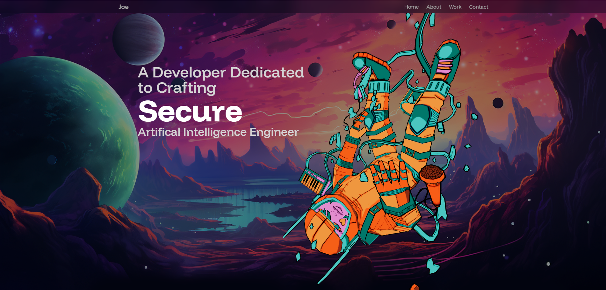

# JOEDUCER-3D-Portfolio 🚀  

An interactive **3D portfolio website** built with **Vite**, **React**, and **Tailwind CSS**. This project is designed to showcase creative projects, skills, and interactive experiences in a modern and responsive way.

---

## ✨ Features  
- ⚡ Lightning-fast development with **Vite**  
- 🎨 Styled using **Tailwind CSS**  
- 🧩 Built with **React** components  
- 🌐 Interactive **3D elements** (via React Three Fiber / Drei)  
- 📱 Fully responsive design for mobile, tablet, and desktop  

---

## 🛠️ Tech Stack
React 18 – UI library
Vite – Fast build tool
Tailwind CSS – Utility-first CSS framework
React Three Fiber / Drei – For 3D models and interactivity
ESLint – Code linting & consistency
